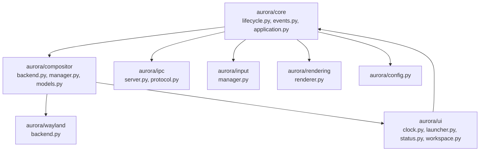

# Aurora Modular Architecture

Aurora is designed as a clean, highly modular Linux desktop shell environment. Instead of a monolithic layout, Aurora separates core control flow, window management models, Wayland bindings, rendering, input, and user interface panels into distinct modules.

---

## 1. Subsystem Descriptions

### 1.1 Aurora Core (`aurora/core/`)
Manages startup, initialization, runtime state, and clean shutdown of the shell.
- [application.py](file:///home/surya/Projects/Aurora/Aurora/aurora/core/application.py): Orchestrates application startup, service registration, and lifecycle state changes.
- [lifecycle.py](file:///home/surya/Projects/Aurora/Aurora/aurora/core/lifecycle.py): Defines the unified application lifecycle states (`CREATED`, `INITIALIZING`, `RUNNING`, `STOPPING`, `STOPPED`, `ERROR`).
- [events.py](file:///home/surya/Projects/Aurora/Aurora/aurora/aurora/core/events.py): Implements a lightweight publish-subscribe `EventBus` allowing decoupling between modules.

### 1.2 Window Management Abstraction (`aurora/compositor/`)
Defines the core data models and interfaces for window management, independent of Wayland backend implementation details.
- [models.py](file:///home/surya/Projects/Aurora/Aurora/aurora/compositor/models.py): Contains typed dataclasses representing core desktop concepts (`WindowModel`, `WorkspaceModel`, `MonitorModel`, `KeyboardModel`, `PointerModel`).
- [backend.py](file:///home/surya/Projects/Aurora/Aurora/aurora/compositor/backend.py): The abstract interface (`CompositorBackend`) defining operations like opening, closing, moving, resizing, focusing windows, and switching workspaces.
- [mock_backend.py](file:///home/surya/Projects/Aurora/Aurora/aurora/compositor/mock_backend.py): A temporary offline backend used for testing and UI layout design without requiring a running Wayland session.
- [manager.py](file:///home/surya/Projects/Aurora/Aurora/aurora/compositor/manager.py): Wraps the active compositor backend to expose unified control commands to the core shell.

### 1.3 Wayland Integration (`aurora/wayland/`)
Handles protocol bindings and communication with the hardware compositor backend.
- [backend.py](file:///home/surya/Projects/Aurora/Aurora/aurora/wayland/backend.py): Entry point for Wayland protocols. In future phases, this will interact with PyWayland/wlroots or a custom compositor loop.

### 1.4 Configuration Management (`aurora/config.py`)
Loads, validates, and merges shell configurations.
- Reads default keys from [config/defaults.json](file:///home/surya/Projects/Aurora/Aurora/config/defaults.json) and allows cascading merges from user-provided custom configuration overrides.

### 1.5 IPC Layer (`aurora/ipc/`)
Provides inter-process communication mechanisms, enabling external clients/utilities to query status or issue commands.
- [protocol.py](file:///home/surya/Projects/Aurora/Aurora/aurora/ipc/protocol.py): Structured IPC message formats.
- [server.py](file:///home/surya/Projects/Aurora/Aurora/aurora/ipc/server.py): Command dispatcher registering callbacks for different client messages.

### 1.6 Input Management (`aurora/input/`)
Keeps track of cursor position, mouse buttons, layout configurations, and active keyboard modifiers.
- [manager.py](file:///home/surya/Projects/Aurora/Aurora/aurora/input/manager.py): Tracks keyboard layout settings and pointer positions.

### 1.7 Rendering (`aurora/rendering/`)
Houses abstractions for rendering shell surfaces and compositor frames.
- [renderer.py](file:///home/surya/Projects/Aurora/Aurora/aurora/rendering/renderer.py): Placeholder for future OpenGL/Vulkan rendering backend integrations.

### 1.8 Graphical Shell (`aurora/ui/`)
The visual desktop overlay implemented in Qt (PySide6 / PyQt6).
- Renders panels, launcher menus, clock indicators, system status metrics, and workspace navigation buttons.

---

## 2. Startup Flow

The startup sequence is intentionally linear and observable:

1. **Bootstrap**: The entry point in `main.py` parses arguments.
2. **Config Load**: Resolves settings and merges custom profiles.
3. **Core Application**: Instantiate `AuroraApplication` and transitions to `CREATED` state.
4. **Service Registration**: Instantiates and registers key modules (e.g. `CompositorManager`, `InputManager`, `IPCServer`) into the Application service registry.
5. **Initialization**: Transitions to `INITIALIZING`. Triggers setup routines and connects component event listeners.
6. **GUI Launch**: Renders visual panels and begins the Qt GUI thread loop.
7. **Shutdown**: Transitions to `STOPPING` and finally `STOPPED` state, cleaning up services and saving state.
